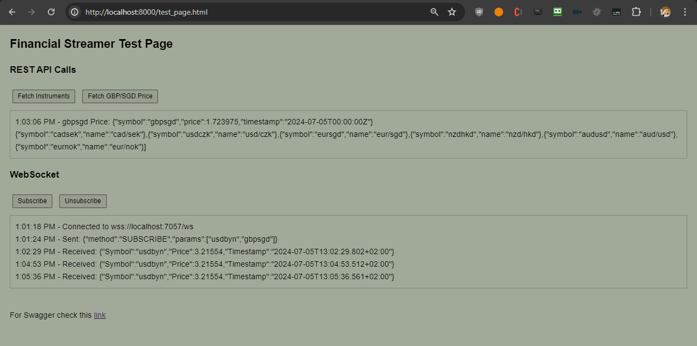

## Financial Streamer

### Overview
Financial Streamer is a service that provides REST API and WebSocket endpoints for live financial instrument prices sourced from a public data provider. It is designed to efficiently handle over 1,000 subscribers.

### Features and Requirements Fulfillment

#### 1. REST API
- **Endpoint to get a list of available financial instruments**: Implemented in `PricesController.cs` with the `GetInstruments` method.
- **Endpoint to get the current price of a specific financial instrument**: Implemented in `PricesController.cs` with the `GetPrice` method.

#### 2. WebSocket Service
- **Subscribe to live price updates for a specific financial instrument(s)**: Implemented in `WebSocketHandler.cs` with the `HandleWebSocketAsync`, `HandleMessageAsync`, and `AddSubscriberAsync` methods.
- **Broadcast price updates to all subscribed clients**: Implemented in `WebSocketHandler.cs` with the `BroadcastPriceUpdateAsync` method.

#### 3. Data Source
- **Use Tiingo API for live price data**: Implemented in `TiingoPriceDataProvider.cs` using the `Restless.Tiingo.Client` and `Restless.Tiingo.Socket.Client` libraries.

#### 4. Performance
- **Efficiently manage 1,000+ WebSocket subscribers**: The code uses `ConcurrentDictionary` to manage subscribers and ensures only one subscription per symbol to the data provider, optimizing resource usage. Detailed comments are included in the code to explain how high traffic is handled.

#### 5. Logging and Error Reporting
- **Implement event and error logging capabilities**: Logging is implemented throughout the code using `ILogger`. An `ErrorHandlingMiddleware` is added to catch and log unhandled exceptions, providing a consistent error response format.

### Project Structure
- **FinancialStreamer.Api**: Contains the REST API and WebSocket endpoint configurations.
- **FinancialStreamer.Core**: Defines the interfaces and models used across the application.
- **FinancialStreamer.Infrastructure**: Contains the services and configuration for interacting with the Tiingo API.
- **FinancialStreamer.WebSocket**: Manages WebSocket connections and message handling.
- **wwwroot**: Contains static files including `test_page.html` for testing the WebSocket and REST API endpoints.

### Getting Started

1. **Clone the Repository**
   ```bash
   git clone https://github.com/jalle007/FinancialStreamer.git
   cd FinancialStreamer
   ```

2. **Build the Solution**
   ```bash
   dotnet build
   ```

3. **Run the Solution**
   ```bash
   dotnet run --project FinancialStreamer.Api --launch-profile https
   ```

3. **Start Python HTTP Server for Testing**
   ```bash
   cd FinancialStreamer.Api/wwwroot
   python -m http.server 8000

   ```


4. **Access the Test Page and Swagger UI**
   - Test Page: [http://localhost:8000/test_page.html](http://localhost:8000/test_page.html)
   - Swagger UI: [https://localhost:7057/swagger/index.html](https://localhost:7057/swagger/index.html)

### Usage

#### REST API Endpoints
- **Get Instruments**
  - URL: `/api/Prices/instruments`
  - Method: `GET`
  - Response: List of available financial instruments (e.g., EURUSD, USDJPY, BTCUSD)

- **Get Price**
  - URL: `/api/Prices/{symbol}`
  - Method: `GET`
  - Response: Current price of the specified financial instrument

#### WebSocket Endpoints
- **Subscribe to Price Updates**
  - Connect to the WebSocket server at: `wss://localhost:7057/ws`
  - Send a message to subscribe:
    ```json
    {
        "method": "SUBSCRIBE",
        "params": ["usdbyn", "gbpsgd"]
    }
    ```

- **Unsubscribe from Price Updates**
  - Send a message to unsubscribe:
    ```json
    {
        "method": "UNSUBSCRIBE",
        "params": ["usdbyn"]
    }
    ```

### Error Handling
- **Global Error Handling**: Implemented via `ErrorHandlingMiddleware`, which catches and logs all unhandled exceptions, returning a standardized error response.
- **WebSocket Error Handling**: Logs and handles exceptions during WebSocket message handling, ensuring the connection is cleanly closed on errors.

### Performance Considerations
- Uses `ConcurrentDictionary` for efficient management of WebSocket subscribers.
- Ensures only one active subscription per symbol to the data provider, reducing redundant connections.
- Detailed logging provides insights into performance and potential issues.

### App in Action




